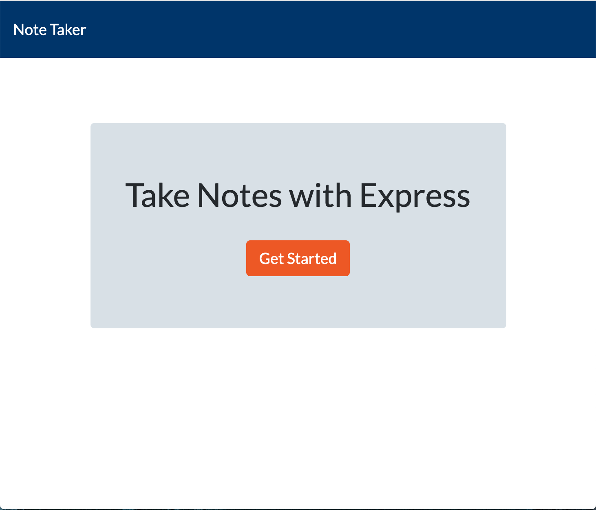
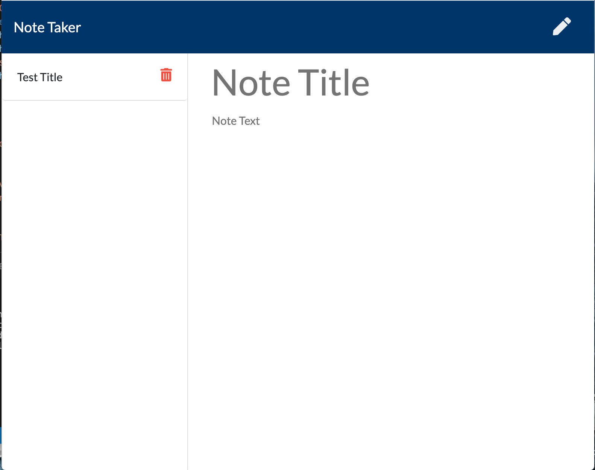

# Homework Note Taker

## Project Description:
Created a note taker that helps users keep track of their to-do list. The users are then able to save and delete each note.

## Installation:
* NPM Express

## Usage:
The user can create a new task, which has a title and a body text. The user, when satisfied with the task information, can save it and go back to it for reference. Once the user is done with that specific task, it can be deleted from the app.

## Contributing:
* NPM Express

## Project Preview:
The website looks like the image below:

